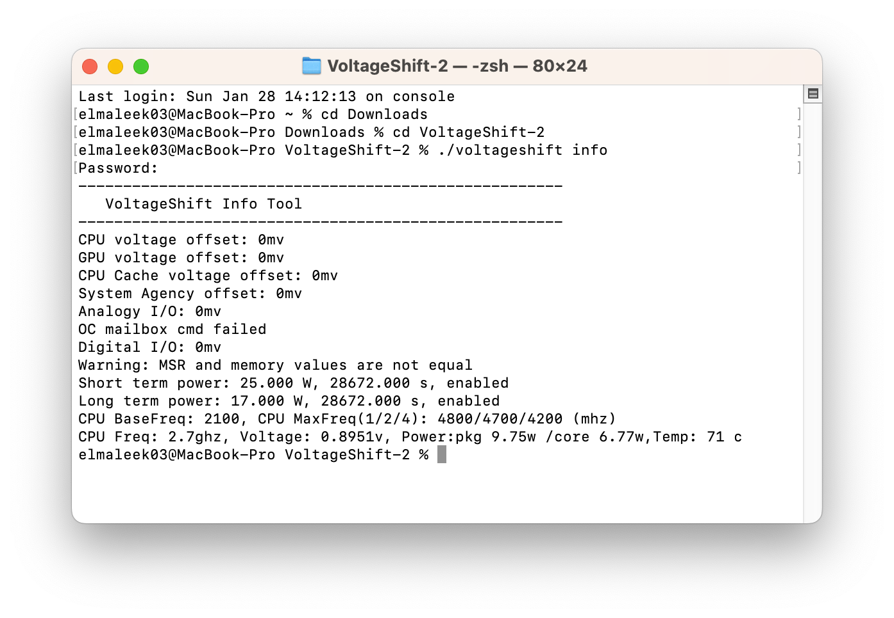

# HP-Elitebook-x360-1030-G4-Hackintosh

A repo for installing macOS Ventura on HP Elitebook x360 1030 G4 using OpenCore.

# Laptop's Hardware 
Tested Ventura, Sonoma.

# Laptop's Hardware 
- <b>CPU</b>: [Intel i7 8665u](https://www.intel.co.id/content/www/id/id/products/sku/193563/intel-core-i78665u-processor-8m-cache-up-to-4-80-ghz/specifications.html) Quad-Core CPU 1.9Ghz (Whiskey Lake-U)
- <b>GPU</b>: Intel UHD 620 Graphics (Enabled GuC Firmware, better iGPU Perfromance)
- <b>Storage</b>: 1TB Adata XPG Gammix S70 Blade PCIe Gen 4.0
- <b>RAM</b>: 16 GB LPDDR3 2133MHz
- <b>Screen</b>: 13.3-inch FHD 1000 Nits with SureView (1920 x 1080) 120Hz
- <b>Touchscreen</b>Wacom WCOM4890
- <b>Trackpad</b>: SYNAPTICS SYNA30A0 (I2C)
- <b>Wi-Fi</b>: Intel Wireless Dual-Band AX200
- <b>Ports</b>: 2 x USB-C Thunderbolt 3, 1 x USB 3.2, 1x HDMI Output

# Improving Performance
This laptop has a bad performance, slow and stuttering experience when using this laptop with macOS. Its caused by the the thermal and power limit throttling. You can do use a good quality thermal paste, and do some modification of the PL1 and PL2 and the Time Window value using the voltageshift fork from [here](https://github.com/daliansky/XiaoMi-Pro/files/3101379/VoltageShift.zip) - credits to buliaoyin for the custom binaries

i applied 17W with 28673s Time Window and 25W with 28673s for my cofig (yours may depend on your thermal condition, find the ones config that suits better for you)

# What's Working?
- CPU with Native Power Management and CpuFriend for better performance
- UHD 620 GPU with Apple Guc Firmware loaded, far better than the Host Preemptive
- Keyboard with All the Hotkeys, brightness, volume button, 
- Touchpad, work with all gestures
- Touchscreen, works and behave like touchpad with all the gestures etc
- Wifi / Bluetooth
- Side physical volume buttons

# What's Not Working?
- Fingerprint Scanner
- HP FHD Camera (Caused by Windows Helllo IR)
- Internal Mic (INTEL SST Moment)
- Thunderbolt 3 (Not tested, i have no device to test)

# Bugs
- SureView Brightness cannot be adjusted, regular one works well

# BIOS Configuration
- Too lazy to write it here lol

# Credits
- [Apple](https://www.apple.com) for macOS.
- [Acidanthera](https://github.com/acidanthera) for most of the kexts.
- [RehabMan](https://github.com/RehabMan) for some ACPI patches.
- [Steve Zheng](https://github.com/stevezhengshiqi) for some patches.
- [zhen-zen](https://github.com/zhen-zen) for YogaSMC.
- [Hiep Bao Le](https://github.com/hieplpvip) for AppleBacklightSmoother
- [Sniki](https://github.com/Sniki) for some patches.
- [daliansky](https://github.com/daliansky) for some ACPI patches.
- [Moh_Ameen](https://github.com/ameenjuz) for some ACPI patches.
- [blackosx](https://github.com/blackosx/OpenCanopyIcons) for OpenCanopyIcons theme.
- [al3xtjames](https://github.com/al3xtjames) for clover-theme-oss theme.
- [ImmersiveX](https://github.com/ImmersiveX) for clover-theme-minimal-dark theme.
- [buliaoyin](https://github.com/buliaoyin/VoltageShift) for the fork of VoltageShift
- And anyone else that helped to develop and improve hackintoshing.
