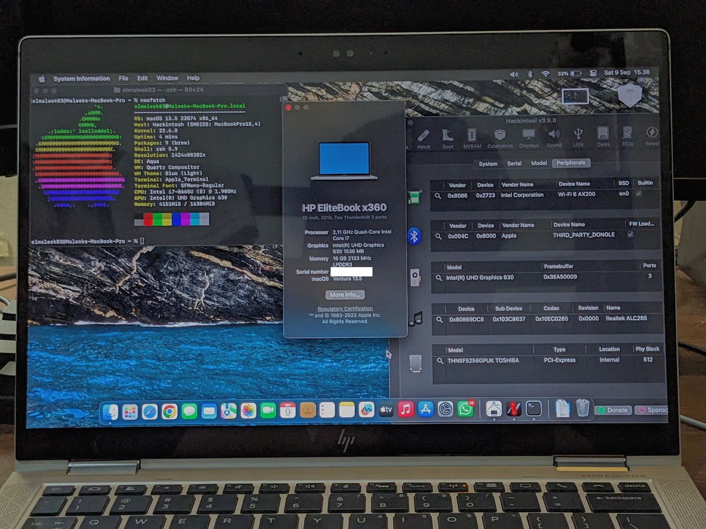

# HP-Pavilion-x360-14-Hackintosh

A repo for installing macOS Ventura on HP Elitebook x360 1030 G4 using OpenCore.

# Laptop's Hardware 
- <b>CPU</b>: [Intel i7 8665u](https://www.intel.co.id/content/www/id/id/products/sku/193563/intel-core-i78665u-processor-8m-cache-up-to-4-80-ghz/specifications.html) Quad-Core CPU 1.9Ghz (Whiskey Lake-U)
- <b>GPU</b>: Intel UHD 620 Graphics 
- <b>Storage</b>: 256GB Toshiba OEM NVME PCIe SSD
- <b>RAM</b>: 16 GB LPDDR3 2133MHz
- <b>Screen</b>: 13.3-inch FHD 1000 Nits with SureView (1920 x 1080) 120Hz
- <b>Touchscreen</b>Wacom WCOM4890
- <b>Trackpad</b>: SYNAPTICS SYNA30A0 (I2C)
- <b>Wi-Fi</b>: Intel Wireless Dual-Band AX200
- <b>Ports</b>: 2 x USB-C Thunderbolt 3, 1 x USB 3.2, 1x HDMI Output

# Overview 

# What's Working?
Everything Works 

# What's Not Working?
- Fingerprint Scanner
- HP FHD Camera (Caused by Windows Helllo IR)
- Internal Mic (INTEL SST Moment)

# Bugs
- ?

# BIOS Configuration
Before doing anything, make sure to update your BIOS to the latest version from [here](https://pcsupport.lenovo.com/us/en/products/laptops-and-netbooks/300-series/320-14ikb/downloads/ds121587), preparing your laptop to macOS, reboot your laptop, when the Lenovo logo appears press <b>F2</b>, when the BIOS menu appears go to: 
- "Configuration" <b>SATA Controller Mode</b> to <b>AHCI</b>, <b>HotKey Mode</b> to <b>Enabled</b>.
- "Security" <b>Intel Platform Trust Technology</b> to <b>Disabled</b>, <b>Intel SGX</b> to <b>Disabled</b>, <b>Secure Boot</b> to <b>Disabled</b>.
- "Boot" <b>Boot Mode</b> to <b>UEFI</b>,<b>Fast Boot</b> to <b>Disabled</b>, <b>USB Boot</b> to <b>Enabled</b>.
- "Exit" <b>OS Optimized Defaults</b> to <b>Disabled</b>.

# Credits
- [Apple](https://www.apple.com) for macOS.
- [Acidanthera](https://github.com/acidanthera) for most of the kexts.
- [RehabMan](https://github.com/RehabMan) for some ACPI patches.
- [Steve Zheng](https://github.com/stevezhengshiqi) for some patches.
- [zhen-zen](https://github.com/zhen-zen) for YogaSMC.
- [Hiep Bao Le](https://github.com/hieplpvip) for AppleBacklightSmoother
- [Sniki](https://github.com/Sniki) for some patches.
- [daliansky](https://github.com/daliansky) for some ACPI patches.
- [Moh_Ameen](https://github.com/ameenjuz) for some ACPI patches.
- [blackosx](https://github.com/blackosx/OpenCanopyIcons) for OpenCanopyIcons theme.
- [al3xtjames](https://github.com/al3xtjames) for clover-theme-oss theme.
- [ImmersiveX](https://github.com/ImmersiveX) for clover-theme-minimal-dark theme.
- And anyone else that helped to develop and improve hackintoshing.
